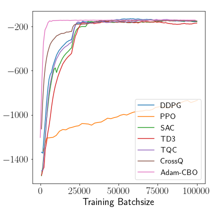

# Reviewer NtTj

Thank you very much for your thoughtful review and valuable feedback.

1. Regarding **the lack of comparison with gradient-based methods**, we would like to clarify that traditional gradient-based approaches typically fall into two specific categories:

    + Model-based methods: These methods assume access to an analytical model of the system, enabling the derivation and solution of the Hamilton–Jacobi–Bellman (HJB) equation. This is the classical setting of optimal control, where gradients can be computed explicitly.

    + Model-free methods with infinitesimal time horizons: In these cases, even without access to a model, the Bellman principle can be leveraged under an infinitesimal (or discounted infinite) time horizon, allowing for recursive value updates.

    However, our work addresses a more general and challenging setting: finite time horizon and model-free stochastic control. In this regime, the assumptions required by typical gradient-based methods—either model knowledge or discount-based recursion—are not available. This makes a direct application or comparison with former methods non-trivial or inapplicable.
    
    That said, we do compare our method with an HJB-based approach and demonstrate that, despite using significantly less information, our method achieves better accuracy. Additionally, following the suggestion of Reviewer yqHf, we have included empirical comparisons with popular model-free policy gradient methods such as PPO, SAC, TRPO, and DDPG. While our method performs competitively, we would like to emphasize that it is designed for more general settings—specifically, finite-horizon, model-free stochastic control problems—which are not directly addressed by these existing methods.

2. **On the motivation for using multi-agent consensus in a single-agent control problem**:

    Since gradients are not accessible in our setting, we rely on multiple agents to explore the state space collaboratively. By exchanging information and moving toward consensus, the agents are able to approximate the optimal policy in a robust manner. We have expanded the introduction to clarify this motivation more explicitly.

3. **On why value estimation exhibits lower variance than gradient estimation**: 

    Monte Carlo value estimation computes the expected return by averaging cumulative rewards over entire trajectories, which smooths out the variability from individual time steps. In contrast, gradient estimation requires sensitivity analysis at each step, and in finite-horizon problems, this leads to high variance due to sparse or noisy signal propagation through time. We have added this explanation to the main text for clarity.

# Reviewer 1fhy

Thank you for your insightful comments and thoughtful suggestions for improving our work.

1. **On the lack of comparison with existing methods and experiments on high-dimensional problems without analytical solutions**:

    We would like to emphasize that our primary goal is to address a more general class of stochastic control problems than those typically handled by existing methods. As discussed in our response to Reviewer NtTj, most conventional approaches rely on access to either model gradients or infinitesimal time horizons, whereas our method operates in a model-free, finite-horizon setting—a scenario that is less explored in the literature.

    That said, we appreciate the reviewer’s suggestion and have applied our method to control problems involving 2, 4, and 50 agents, similar in spirit to [1]. The corresponding numerical results can be found here. 
    
    We note, however, that our setup differs from [1] in important ways: our approach is based on closed-loop (feedback) control, while [1] employs open-loop control. Furthermore, [1] treats obstacles as hard constraints, whereas we model them as soft constraints through penalization in the cost function. Due to these differences, a direct comparison is not meaningful, but we believe our results still highlight the scalability and flexibility of our approach.

2. **On the adjustable Gaussian noise that can help exploration:**

    We appreciate the reviewer’s suggestion and we want to added two experiments to explain the role of adjustable Gaussian noise. 

    The fist one, we compare the result of cbo with and without gaussian noise when optimizing a two dimensional Rastigrin function.The numerical result can be found here.  
    
    The starting points are normal distribution centered at [3,3] or [-3,-3] for the two cases respectively. The cbo with gaussian noise can escape from the local minimum and find the global minimum, while the cbo without gaussian noise is stuck in the local minimum. 

    The second case, we show the evolution of one parameter in the neural network when training the LQG probelm under fixed Gaussian and adjustable Gaussian noise. The numerical result can be found here.  
    
    If we fix a large Gaussian noise, the parameter can explore more (the parameters are more different from the starting points), but it will keep high variance in a long time and cannot converge. If we fix a small Gaussian noise, the parameter can converge very fast, but it do not explore too much on the space (the parameters are close to the starting points). If we use adjustable Gaussian noise, the parameter can explore more at the beginning and converge fast at the end. The adjustable Gaussian noise give us many flexibility to balance the exploration and exploitation. If we know the parameter is close to the optimal solution, for some fine-tuning problems, we can use a small Gaussian noise to converge fast. If we are not sure the parameter is close to the optimal solution, we can use a large Gaussian noise to explore more and iteratively reduce the noise to converge.

    The last point, why we claim the adjustable noise can effectively scale to high dimenisons problems comes from some former analytical result. By adding the Gaussian noise, the paper [2] shows that the convergence of the CBO  method, which is exponential in time, is guaranteed with parameter constraints **independent** of the dimensionality. Even though we do not do the same analysis for our method, we believe the conlusions are similar.

    [2] Jose A. Carrillo, et al. "A consensus-based global optimization method for high dimensional machine learning problems." ESIAM: Control, Optimisation and Calculus of Variations.

3. **On the concern about "the lack of comparison to existing methods"**

    We would like to emphasize twice that our work is not intended to be a direct comparison with existing methods, but rather to demonstrate the effectiveness of our approach in a more general setting. However, we added some comparison of our method with PPO, SAC, TD3, TQC, CrossQ and DQN. The numerical results can be found here 
    

    
    
    

    We want to cariify that the results are not directly comparable, since the methods are designed for different settings, which we refer to repsond to reviewer yqHf for more details.

# Reviewer yqHf
Thank you for your insightful comments and thoughtful suggestions for improving our work.

1. **On "Why comparison with existing SOC methods limited?"**

    We would like to clarify that the goal of our work is **not to provide a direct comparison with existing methods**, but rather to demonstrate that our approach is applicable in a more general setting—specifically, **finite-horizon, model-free stochastic control problems**. To the best of our knowledge, existing methods—such as those based on DP or HJB—cannot directly address this setting.

    That said, we do compare with an HJB-based method and show that our approach achieves  **better accuracy using significantly less information** (i.e., no model access).

    Following the reviewer’s suggestion, we added comparisons with **DDPG**, **PPO**, **SAC**, **TD3**, **TQC**, and **CrossQ** (using the [stable-baselines3 implementions]("https://github.com/araffin/sbx") ) on **Pendulum-v1** as well as PPO and DQN on **CartPole-v1**. The numerical results can be found here 
    
      

    Below is the computational time for each method over 100,000 steps:

    | Method    | Time (s) for Pendulum-v1 | Time (s) for CartPole-v1 |
    |-----------|--------------------------|--------------------------|
    | DDPG      | 288.83   | |
    | PPO       | 145.19   | 150.58 |
    | SAC       | 355.01   | |
    | TD3       | 291.26   | |
    | TQC       | 576.35   | |
    | CrossQ    | 708.73   | |
    | DQN       |          |  186.13 |
    | **Adam-CBO**  | **1124.88**  | **3444**
    

    While **Adam-CBO** has higher runtime, it **converges to the optimal policy much faster** in terms of learning efficiency.
    However, we would like to stress that these results are **not directly comparable** in a strict sense. Most of the baseline methods optimize multiple components—for example, PPO jointly optimizes a policy and a value function, and SAC optimizes two Q-functions and a policy. In contrast, **our method optimizes only the policy**.

    If we were to directly replace the gradient-based optimizer within an existing method like PPO with Adam-CBO, we **do not expect** it to outperform the full method in that specific setup. The **main advantage** of Adam-CBO lies in its **applicability to broader, more general settings**, particularly when gradients are unavailable or unreliable.

2.  **On "Adam-CBO vs. M-CBO – performance gap?"** 

    We compare the two in the first experiment and find Adam-CBO consistently outperforms M-CBO. Later experiments focus on Adam-CBO for this reason.
    However, M-CBO is more analytically tractable, so we base theoretical results on it. Analyzing Adam-CBO theoretically is challenging but remains an exciting direction for future work.

3. **On "Is transition kernel here continuous or piecewise continuous? how does this method handle discontinuous state transitions?"**

    Our method assumes continuous state transitions. However, it supports discrete actions, as shown in CartPole-v1. There, we use a neural network to produce a real-valued score, and select an action by comparing this score against a uniform random threshold, allowing the method to work with discrete actions. 

4. **On "Why is no discount factor accounted, any risk in terms of instability because of the absense of discounting?"**
    
    Discounted infinite-horizon problem is a **special case** of our formulation. While our method can easily incorporate a discount factor, our focus is on **finite-horizon problems**, where **discounting is unnecessary**. In these settings, the finite time naturally bounds the reward accumulation, and the absence of a discount factor does not lead to instability.

5. **On "Real-world large-scale SOC examples / scalability?"**
    
    We added tests on 2, 4, and 50-agent control scenarios. Results are available here. 
    
     
    
    We refer to our response to Reviewer 1fhy for more details on the numerical results.

    We currently do not do any real world experiments, but we are interesting in exploring
    + Controlling particle distributions via external fields without modeling distribution evolution
    + Identifying transition paths in chemistry without full potential surfaces

6. **On "Stopping condition for Algorithm 1?"**

    We stop when the standard deviation of policy parameters across agents falls below a threshold, indicating convergence. We will clarify this in the main text.

7. **On "Stability constraints on pages 6–7?"**

    Thank you for this question. We were not able to identify specific "stability constraints" on pages 6–7. If the reviewer could point to a particular equation or passage, we’d be happy to clarify or revise the relevant text to improve clarity.

# Reviewer tREQ

Thank you for your thoughtful review and valuable feedback.

1. **On “ Assumption 4.1.4”**

    Indeed, the assumption can be generalized as 
    $$\|\theta - \tilde\theta\| \leq \frac{(\mathcal{J} -\underline{ J})^\mu}{\eta}$$ 
    for some $\mu,\eta>0$ .
    When $\mu=\frac{1}{2}$, the condition is in general correct if $J$ is continuous near the minimum points, becase
    $$
    J(\theta) = J(\tilde \theta) + \nabla J(\tilde \theta)^T (\theta - \tilde \theta) + \frac{1}{2} (\theta - \tilde \theta)^T \nabla^2 J(\tilde \theta) (\theta - \tilde \theta) + o(\|\theta - \tilde \theta\|^2)
    \\
    = J(\tilde \theta) + \frac{1}{2} (\theta - \tilde \theta)^T \nabla^2 J(\tilde \theta) (\theta - \tilde \theta) + o(\|\theta - \tilde \theta\|^2)\\
    \geq  J(\tilde \theta)  + C \|\theta - \tilde \theta\|^2,
    $$ 
    where $C$ is the smallest eigenvalue of Hessian matrix $\nabla^2 J(\tilde \theta)$ which is positive at minimum. The revised version of the proof can be seen in here.
    
    
    
    
    
    **On the Clarification**

    Thank you for noting this. We will add the missing dt in equation (1), and clarify that the square in Section 3.2 refers to elementwise squaring.